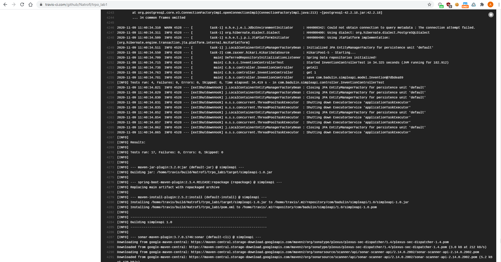
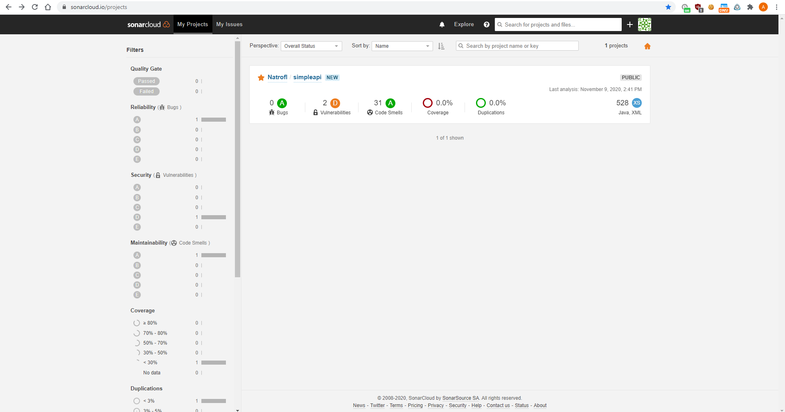
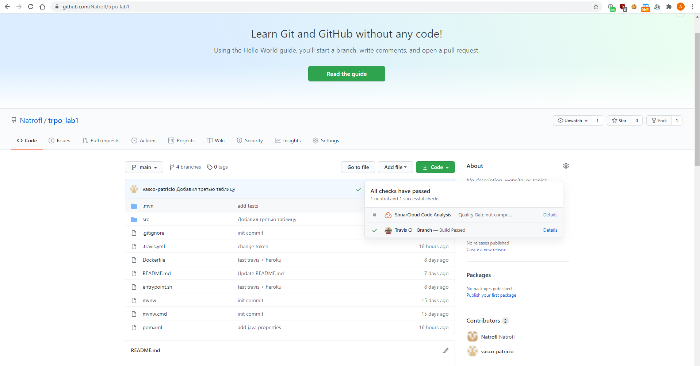

## I
* __Название дисциплины:__ Технологии разработки программного обеспечения
* __Название лабораторной работы:__ Лабораторная работа №1: создание микросервиса на Spring Boot с базой данных (вариант решения задачи повышенной сложности)
* __ФИО и группа:__ Бадулин А.С. ЗМБД2031
* __Цель лабораторной работы:__ Целью лабораторной работы является знакомство с проектированием многослойной архитектуры Web-API (веб-приложений, микро-сервисов)

## II
#### Инструкция по сборке запуску приложения
* Выполнение Unit-тестов, сборка, проверка кода с помощью sonarcloud и поставка прилоежния в heroku происходят в автоматическом режиме после коммита в ветку main
#### Описание таблиц и взаимосвязей
В приложение создает и наполняет данными 3 таблицы: inventions, areas, periods:
* Таблица inventions содержит информацию об изобретениях: название, автор, год, id-исторического периода в который изобретение было изобретено.
* Таблица periods содержит перечень исторический периодов, данная таблица имеет отношение OneToMany к сущностям в таблице inventions
* Таблица areas содержит перечень областей применения изобретений, данная таблица имеет отношение ManyToOne к сущностям в таблице inventions
 
#### Проверки
------------------------------------------------------------------------
__Status__
* __getHostname:__ curl http://simpleapi-badulin.herokuapp.com/api/v1/status
------------------------------------------------------------------------
__CRUD (работа с изобретениями)__
* __create:__ curl -v -H  "Content-Type: application/json" -X POST http://simpleapi-badulin.herokuapp.com/api/v1/invention -d '{"name": "Гравицапа", "inventor": "Неизвестен", "year": "нет данных", "app_area": "мгновенные межгалактические перелёты", "period_id": 1  }'
* __read:__ curl http://simpleapi-badulin.herokuapp.com/api/v1/invention/{id} (id от 1 до 7)
* __update:__ curl -H  "Content-Type: application/json" -X POST http://simpleapi-badulin.herokuapp.com/api/v1/invention -d '{"id": __{id}__, "name": "Гиперболоид", "inventor": "Гарин Пётр Петрович", "year": "~1920", "app_area": "завоевание мирового господства", "period_id": 1 }' (id от 1 до 7)
* __delete:__ curl -X DELETE http://simpleapi-badulin.herokuapp.com/api/v1/invention/{id} (id от 1 до 7)
* __readAll:__ curl http://simpleapi-badulin.herokuapp.com/api/v1/invention

__CRUD (работа с областью применения )__
* __create:__ curl -v -H  "Content-Type: application/json" -X POST http://simpleapi-badulin.herokuapp.com/api/v1/area -d '{"area": "машиностроение", "inv_id": {id-изобретения}  }'
* __read:__ curl http://simpleapi-badulin.herokuapp.com/api/v1/area/{id} (id от 1 до 12)
* __update:__ curl -H  "Content-Type: application/json" -X POST http://simpleapi-badulin.herokuapp.com/api/v1/area -d '{"id": __{id}__, "name": "развлечения", "inv_id": {id-изобретения} }' (id от 1 до 12)
* __delete:__ curl -X DELETE http://simpleapi-badulin.herokuapp.com/api/v1/area/{id} (id от 1 до 12)
* __readAll:__ curl http://simpleapi-badulin.herokuapp.com/api/v1/area

__CRUD (работа с историческими периодами )__
* Работа через RestAPI с историческими периодами не предусмотрена, т.к. их перечень на данный момент неизменен.

__Сопосталвение изобретения и списка областей применения__
* curl http://simpleapi-badulin.herokuapp.com/api/v1/invention/7/area (id от 1 до 7)
* curl http://simpleapi-badulin.herokuapp.com/api/v1/invention/5/area (id от 1 до 7)

__Сопоставление исторического периода и изобретений__
* curl http://simpleapi-badulin.herokuapp.com/api/v1/invention/4/period (id от 1 до 5)
* curl http://simpleapi-badulin.herokuapp.com/api/v1/invention/3/period (id от 1 до 5)

#### Unit tests

####SonarCloud check

